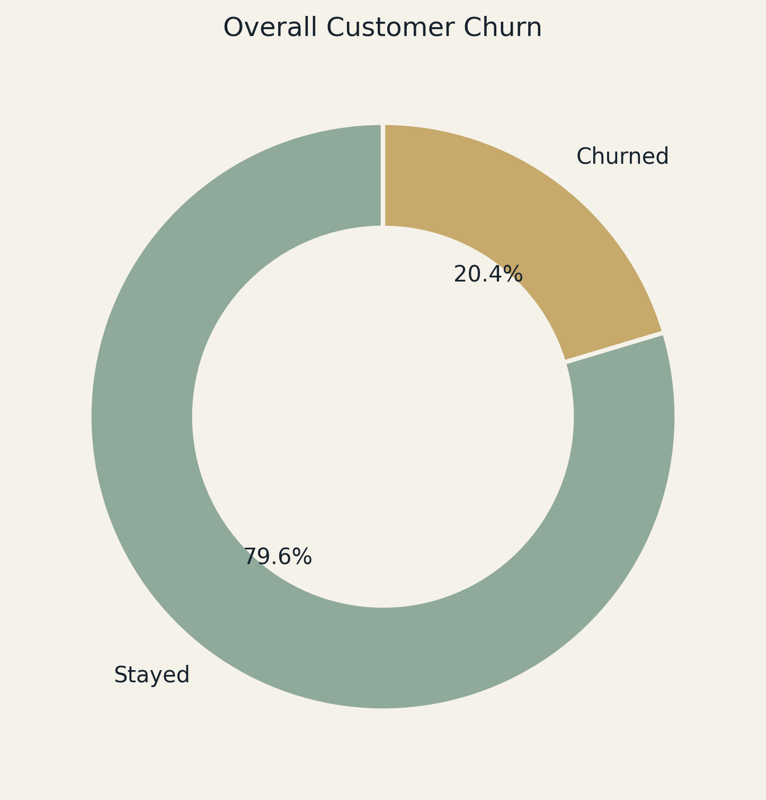
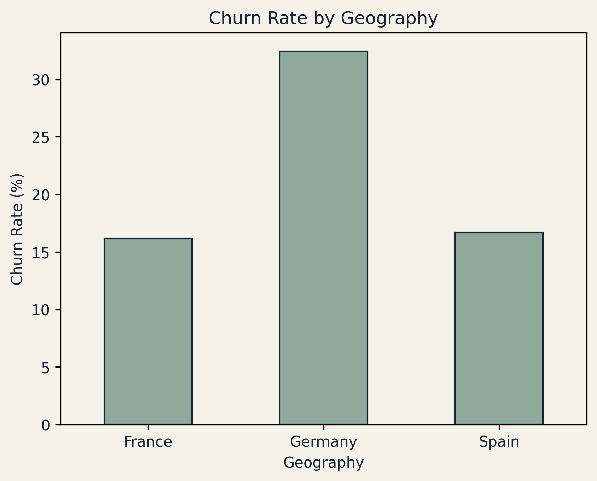
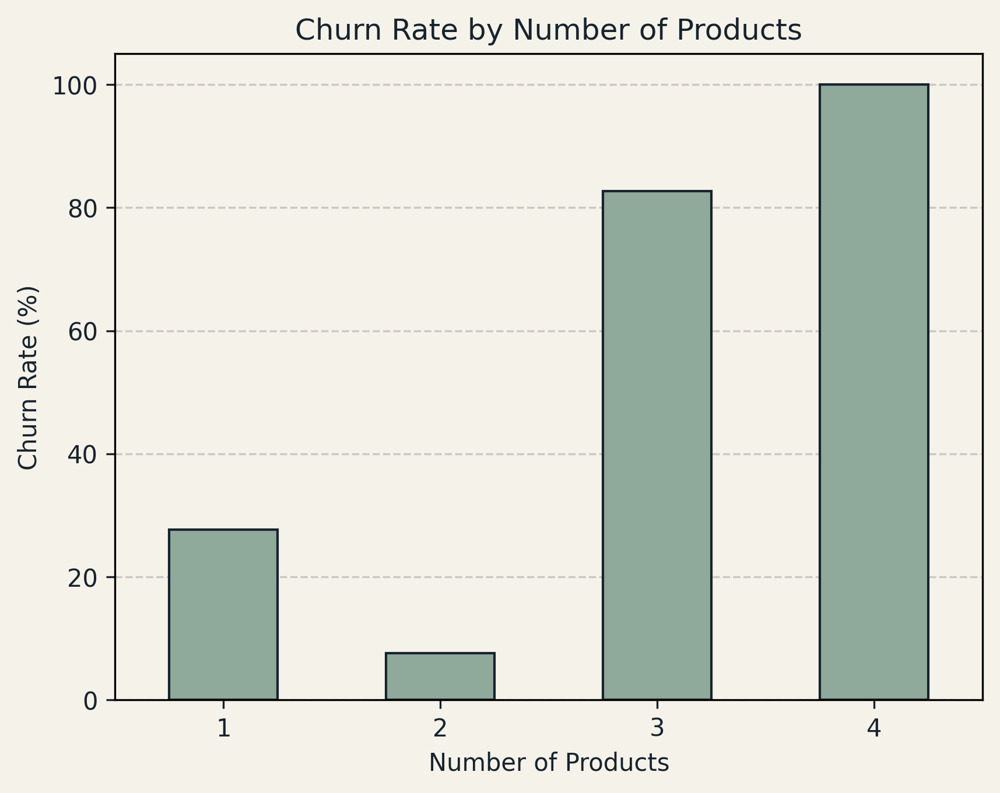
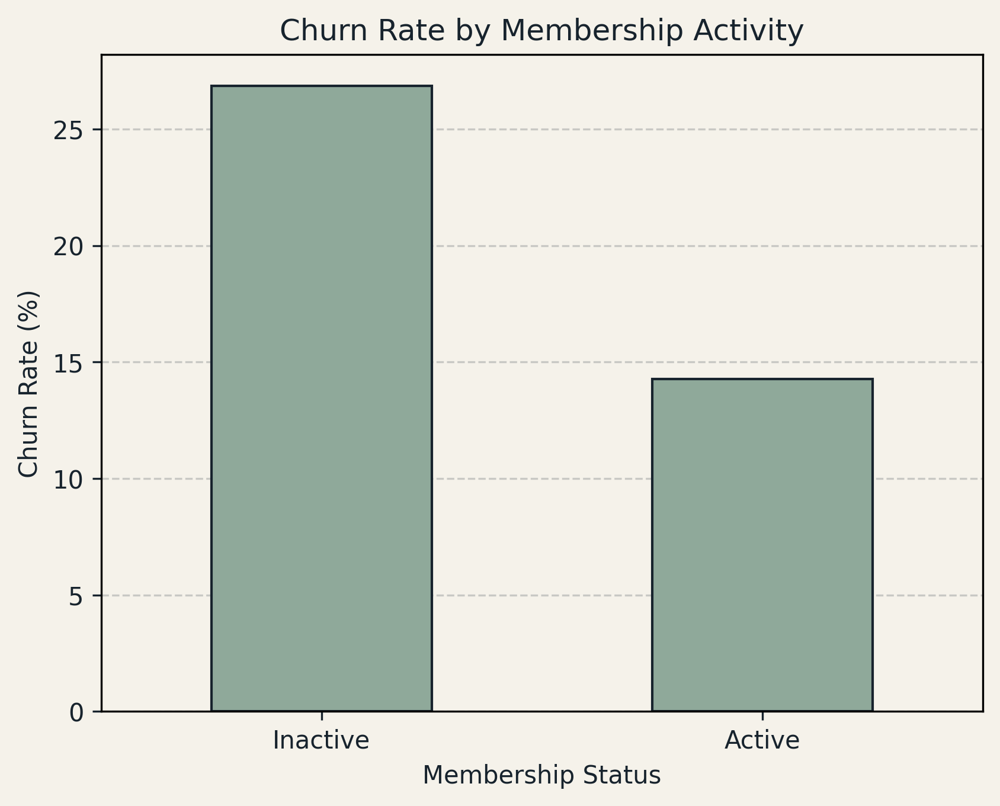
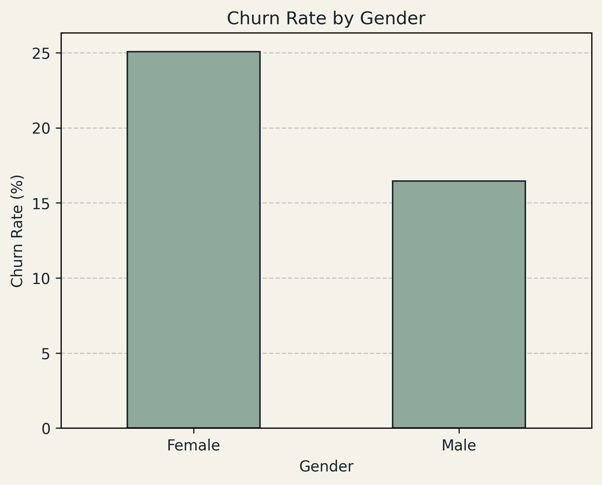
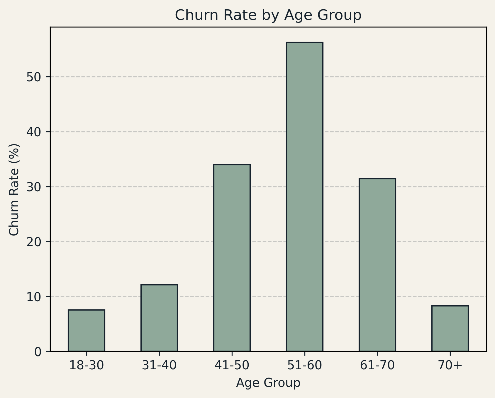
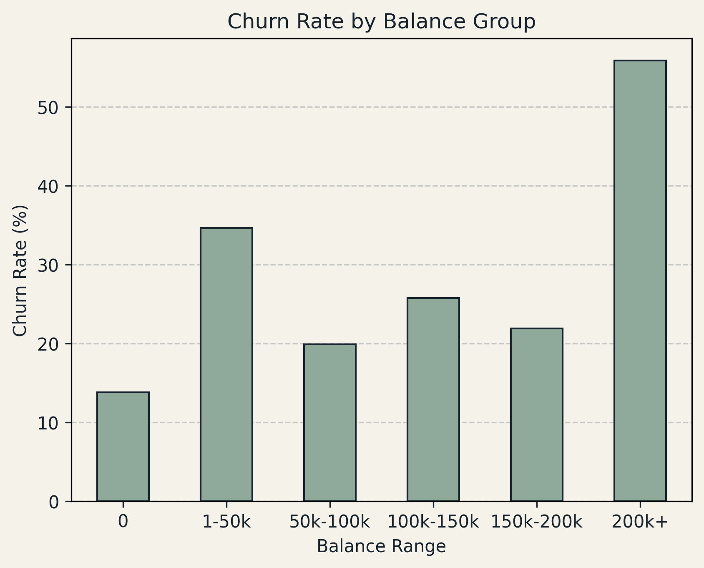
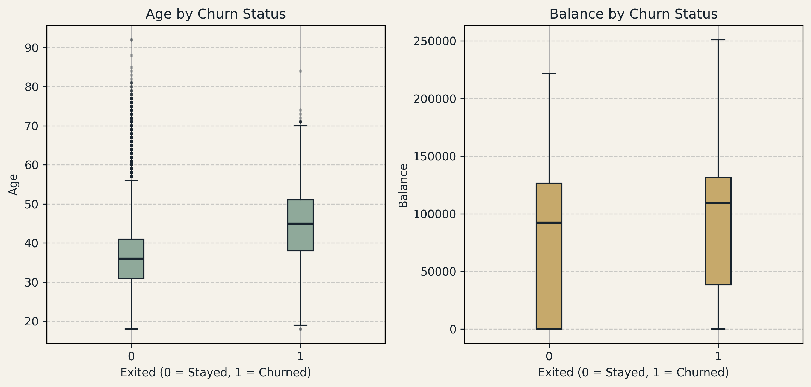
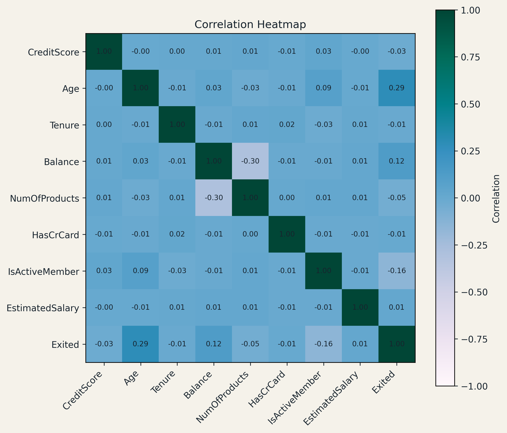

# Bank Customer Churn Analysis

A Business Analyst case study on customer churn for a retail bank operating in France, Germany, and Spain — built end-to-end in **Python/pandas**, as the third project in a BA portfolio series (the first two used SQL + Power BI).

## Overview

- **Goal:** identify which customer segments are most likely to churn, quantify the scale of the problem, and surface actionable recommendations.
- **Dataset:** Kaggle-style "Bank Customer Churn" dataset, delivered as a deliberately messy two-sheet Excel workbook (`Customer_Info`, `Account_Info`) requiring merging, validation, and cleaning.
- **Tools:** Python, pandas, matplotlib, Jupyter (VS Code).
- **Baseline churn rate:** 20.4% (2,037 of 10,000 customers).



## Data Cleaning

The raw workbook contained realistic, deliberately-injected data-quality issues:

- Merged `Customer_Info` + `Account_Info` on `CustomerId`; validated the merge via an outer join and checked for unmatched IDs.
- Removed 4 exact duplicate customer records.
- Cleaned currency symbols out of `Balance` / `EstimatedSalary` and converted to numeric; identified and nulled a `-€999,999` sentinel value hidden in `EstimatedSalary`.
- Found `HasCrCard` was **incorrect** in the working file (it matched `IsActiveMember`'s distribution exactly — a red flag) and corrected it using a clean reference file, joined on `CustomerId`.
- Verified `IsActiveMember` was actually accurate, via a zero-mismatch check against the same reference file, rather than assuming it shared the same bug.
- Standardized inconsistent `Geography` labels (`France` / `French` / `FRA` → `France`).
- Encoded `Gender`, `HasCrCard`, `IsActiveMember` as binary fields.
- Resolved a duplicate `Tenure_cust` / `Tenure_acc` pair (100% matching values) into one `Tenure` column.
- Filled remaining missing values: median for `Age`/`EstimatedSalary`, `"Unknown"` for `Surname`.

**Result:** a validated 10,000-row, 13-column dataset, ready for analysis.

## Key Findings

### Geography
Germany churns at nearly **2x** the rate of France and Spain.

| Country | Churn Rate |
|---|---|
| Germany | 32.4% |
| Spain | 16.7% |
| France | 16.2% |



### Number of Products
2 products is the safest segment (7.6% churn). 3-4 products show very high churn but are small samples (266 / 60 customers) — flagged for further investigation, not treated as proven.



### Membership Activity
Inactive members churn at almost **2x** the rate of active members (26.9% vs 14.3%) — the most reliable, actionable finding in the analysis.



### Gender
Female customers churn more than male customers (25.1% vs 16.5%).



### Age
Churn is non-linear — it peaks sharply in the **51-60** age band (56%+), not just "older = more churn."



### Balance
€0-balance customers churn least (13.8%). The 200k+ segment shows the highest churn (~56%) but is based on only 34 customers — reported as directional only.



### Age & Balance Distributions



### Correlation Overview
Age (0.29), IsActiveMember (-0.16), and Balance (0.12) show the strongest linear relationship with churn — consistent with the segment findings above. `CreditScore`, `Tenure`, and `HasCrCard` show negligible correlation.



## Checked, No Meaningful Pattern

- **CreditScore** — minimal difference between churned/retained customers (645 vs 652).
- **Tenure** — churn rate stays flat (~17-23%) across all tenure lengths.
- **HasCrCard** — negligible difference (20.8% vs 20.2%) once corrected.

## Recommendations

1. Investigate Germany specifically — service, pricing, or competitive factors likely explain the regional gap.
2. Prioritize re-engagement campaigns for inactive members — the strongest, most reliable lever found.
3. Build a targeted retention track for the 51-60 age segment.
4. Review onboarding/product-deepening for 1-product customers; audit the small 3-4 product segment for a possible data/process issue.
5. Treat the €200k+ balance finding as a hypothesis to validate with more data.

## Next Steps

A predictive model (logistic regression / random forest) is planned as a follow-up phase, to move from descriptive findings to a predictive risk score per customer — to be published as an updated version of this project.

## Repo Structure

```
├── data/
│   └── bank_churn_cleaned.csv
├── images/
│   └── (chart PNGs used above)
├── notebook.ipynb
├── Bank_Churn_Analysis_Case_Study.docx
└── README.md
```
